# Simple Linear Regression in Python 📈🐍

[](https://www.python.org/) [](https://jupyter.org/) [](LICENSE)

**Simple Linear Regression in Python** is an educational project demonstrating how to perform linear regression analysis using Python. The analysis is carried out in a Jupyter Notebook, using the [advertising.csv](./advertising.csv) dataset to predict sales based on advertising spend.

---

## 📖 Table of Contents

- [Overview](#overview)
- [Project Highlights](#project-highlights)
- [Dataset Description](#dataset-description)
- [Flow Diagram](#flow-diagram)
- [Project Structure](#project-structure)
- [Installation & Setup](#installation--setup)
- [Usage](#usage)
- [Call-to-Action](#call-to-action)
- [License](#license)
- [Acknowledgements](#acknowledgements)

---

## 🔍 Overview

This project performs a simple linear regression analysis on advertising data to predict sales based on different advertising channels. Using Python and Jupyter Notebook, the project walks through data exploration, visualization, model building, and evaluation. It serves as a straightforward introduction to regression techniques and how they can be used for predictive analytics.

---

## ✨ Project Highlights

- **Data Exploration:**  
  Perform exploratory data analysis (EDA) to understand the distribution of advertising spend and sales.

- **Visualization:**  
  Generate scatter plots and regression lines to visualize relationships between variables.

- **Model Building:**  
  Fit a simple linear regression model to predict sales from advertising spend (e.g., TV, Radio, Newspaper).

- **Evaluation:**  
  Evaluate the model's performance using metrics such as R² and Mean Squared Error (MSE).

---

## 📊 Dataset Description

- **File:** `advertising.csv`
- **Contents:**  
  The dataset includes advertising spending and corresponding sales data. Common features include:
  - **TV:** Advertising dollars spent on TV.
  - **Radio:** Advertising dollars spent on radio.
  - **Newspaper:** Advertising dollars spent on newspapers.
  - **Sales:** Sales generated (dependent variable).
- **Format:** CSV file with rows representing individual observations.

---

## 🔄 Flow Diagram

```mermaid
flowchart TD
    A[📄 Load CSV Data] --> B[🧹 Data Cleaning & Exploration]
    B --> C[📊 Data Visualization]
    C --> D[🛠️ Build Linear Regression Model]
    D --> E[📈 Model Evaluation & Insights]
```



---

## 🗂️ Project Structure

```plaintext
Simple_Linear_Regression/
├── Simple Linear Regression in Python.ipynb  # Jupyter Notebook with the full analysis
├── advertising.csv                           # Dataset file containing advertising and sales data
├── README.md                                 # Project documentation (this file)
└── requirements.txt                          # Python dependencies (e.g., pandas, numpy, matplotlib, seaborn, scikit-learn)
```

---

## 💻 Installation & Setup

### Prerequisites

- **Python 3.8+**
- **Jupyter Notebook**

### Installation Steps

1. **Clone the Repository:**

   ```bash
   git clone https://github.com/yourusername/Simple_Linear_Regression.git
   cd Simple_Linear_Regression
   ```

2. **Set Up a Virtual Environment:**

   ```bash
   python -m venv venv
   source venv/bin/activate  # For Windows: venv\Scripts\activate
   ```

3. **Install Required Packages:**

   Make sure your `requirements.txt` includes:
   ```plaintext
   pandas
   numpy
   matplotlib
   seaborn
   scikit-learn
   jupyter
   ```
   
   Then run:
   
   ```bash
   pip install -r requirements.txt
   ```

4. **Launch Jupyter Notebook:**

   ```bash
   jupyter notebook
   ```

---

## 🚀 Usage

- **Open the Notebook:**  
  Launch `Simple Linear Regression in Python.ipynb` in Jupyter Notebook to follow the step-by-step analysis.
  
- **Explore the Analysis:**  
  Execute cells to clean data, visualize relationships, build the regression model, and evaluate performance.

- **Interpret the Results:**  
  Review plots and metrics (e.g., R², MSE) to understand the effectiveness of the model.

---

## ⭐️ Call-to-Action

If you find this project helpful, please consider:
- **Starring** the repository to show your support.
- **Forking** to contribute improvements.
- **Following** for updates on future projects.

Your engagement helps boost visibility and encourages further collaboration!

---

## 📜 License

This project is licensed under the [MIT License](LICENSE).

---

## 🙏 Acknowledgements

- **Data Source:** Thanks to the provider of the advertising dataset.
- **Open Source Libraries:** Gratitude to the maintainers of Pandas, NumPy, Matplotlib, Seaborn, Scikit-Learn, and Jupyter.
- **Contributors:** Special thanks to everyone who has contributed to this analysis.

---

*Happy Analyzing! 🎬📈*
